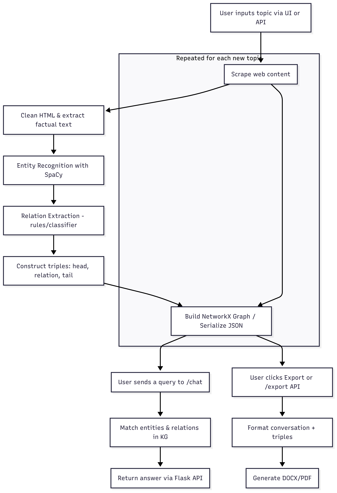

# 🚀 Automated Knowledge Graph Builder with Chat Interface

*End-to-end pipeline for building knowledge graphs from web content and interacting via natural-language chat.*

---

## 📂 Table of Contents

1. [Overview](#overview)
2. [Key Features](#key-features)
3. [Architecture & Data Flow](#architecture--data-flow)
4. [Project Structure](#project-structure)
5. [Quick Start](#quick-start)
6. [Usage Examples](#usage-examples)
7. [Roadmap](#roadmap)
8. [Resources](#resources)
9. [License](#license)

---

## 📃 Overview

This system allows users to:

* Input a technical topic (e.g., "Altera FPGA")
* Automatically scrape the web for relevant information
* Extract entities and relationships
* Build a structured knowledge graph
* Interact with the graph via a chat interface
* Export DOCX reports of the conversation and supporting triples

Everything is integrated in a single pipeline with modular code, extensible to multiple domains.

---

## 🔍 Key Features

* ✅ **Automated web scraping** from search results (Google/Bing)
* ✅ **Clean entity and relation extraction** using SpaCy
* ✅ **Graph construction** with NetworkX
* ✅ **Natural language chat interface** powered by Flask
* ✅ **Export answers + graphs** as formatted DOCX files
* ✅ **React front-end ready** for user-facing deployment

---

## 📊 Architecture & Data Flow

```
         ┌───────────────────┐        ┌───────────────────┐
 Query → │ React  UI    │  REST  │ Flask Back-end  │
         └───────────────────┘  │     │  /chat & /export│
                             ▼
                     ┌───────────────────────┐
                     │ KG in memory │
                     └───────────────────────┘
                             ▲
               build_graph() │
                             ▼
         ┌────────────────────────────┐
         │ WebScraping_*  +  KGConstr. │
         └────────────────────────────┘
```

---

## 🛋️ Project Structure

| File                            | Description                                           |
| ------------------------------- | ----------------------------------------------------- |
| `WebScraping_Small-2.py`        | Searches, scrapes, and cleans web content             |
| `KnowledgeGraphConstruction.py` | Extracts entities/relations and builds the graph      |
| `app.py`                        | Flask server exposing `/chat` and `/export` endpoints |
| `knowledge_graph.json`          | Sample graph data (for topic: Altera FPGA)            |
| `Doc_Task.docx`                 | Documentation summary with visuals and system design  |

---

## 🚀 Quick Start

```bash
# 1. Clone the repo
$ git clone https://github.com/yourusername/kg-chat-app
$ cd kg-chat-app

# 2. Set up virtual environment
$ python -m venv venv
$ source venv/bin/activate

# 3. Install dependencies
$ pip install -r requirements.txt

# 4. Run Flask server
$ python app.py

# 5. Open front-end (React) or call endpoints
```

---


----
## 🔎 Usage Examples

* `POST /chat` with a question like: "What is the on-chip RAM of Stratix?"

  * Response: `"256 KB"`
* `GET /export` → DOCX containing the question, answer, and supporting triples

---

## 🔄 Roadmap

* [ ] Migrate NetworkX to Neo4J for scalable querying
* [ ] Add embedding-based fallback search
* [ ] Token-streamed UI responses
* [ ] Schedule scraping updates via cron jobs
* [ ] Add Playwright + Pytest for scraping & UI regression tests

---

## 📅 Resources

* [SpaCy](https://spacy.io/)
* [NetworkX](https://networkx.org/)
* [BeautifulSoup](https://www.crummy.com/software/BeautifulSoup/)
* [Python-docx](https://python-docx.readthedocs.io/)

---

## 📚 Long Description

This project is an end-to-end **automated knowledge graph builder and chat interface** that converts any technical topic into an interactive, queryable format.

### ① What the project does

With a single command, the system:

1. **Web-scrapes and cleans content** — It performs Google/Bing searches, pulls HTML from top-ranked pages, removes noisy boilerplate, and extracts only fact-rich paragraphs.

2. **Performs entity and relation extraction** — A SpaCy NLP pipeline identifies entities, normalizes terms, and pipes them through a custom rule-based or ML relation classifier.

3. **Constructs a structured graph** — Entities and their semantic relationships are stored in a NetworkX graph. (A future product version will use Neo4J for persistence and graph querying.)

4. **Supports natural-language interaction and report generation** — A Flask backend exposes:

   * `/chat`: accepts user queries like "What is the on-chip RAM of Stratix?" and returns precise answers from the graph (e.g. **256 KB**).
   * `/export`: creates a downloadable, formatted DOCX or PDF containing the conversation history and all graph-backed answers.

All this is wrapped by a user-friendly React front-end, making the system usable even by non-technical users through a simple chat interface.


---

## 📚 What is a Knowledge Graph?

A **Knowledge Graph (KG)** is a structured representation of real-world facts, where **entities** (nodes) are connected by **relationships** (edges). It captures semantic information in the form of subject–predicate–object triples:

```
("Stratix", "hasRAM", "256KB")
```

This means: the *Stratix* FPGA **hasRAM** of *256KB*. These triples form a graph where each entity is a node, and the relationships are labeled edges connecting those nodes.

### Why are KGs useful?

* They offer **interpretable, structured data** for reasoning and search.
* They allow **context-aware querying** like “What is the memory size of Altera Stratix?”
* They serve as a **backbone for intelligent systems**, enabling explainable AI.

### 🛠️ How It Works in This Project

This project builds a Knowledge Graph automatically for any technical topic using the following pipeline:

#### 1. Scrape & Clean Technical Content

* The system pulls relevant pages from Google/Bing based on a query like *“Altera FPGA”*.
* It extracts clean, fact-dense paragraphs using tools like `BeautifulSoup`.

#### 2. Extract Entities & Relations

* The cleaned text is passed through an NLP pipeline (SpaCy) to identify:

  * Entities (e.g., "Stratix", "256KB")
  * Relations (e.g., "hasRAM", "builtBy", "introducedIn")
* The system uses rules or classifiers to infer the relation connecting each entity pair.

#### 3. Construct the Graph

* Each extracted triple is added to a graph $G = (V, E)$, where:

  * $V$: set of entities (nodes)
  * $E$: set of labeled edges representing semantic relationships

* The graph is stored as a JSON object or in memory using NetworkX, and can be exported to Neo4J in the product phase.

#### 4. Enable Natural-Language Q\&A

* Users ask questions like “What company builds Stratix?”
* The backend parses the question, matches it to graph entities/edges, and returns the relevant answer from the graph.
* This removes the need for full-document search, improving **speed and interpretability**.

#### 5. Export and Share

* The conversation and supporting knowledge triples are saved into a formatted DOCX or PDF.
* Useful for technical documentation, research assistants, or teaching tools.

### ✅ Example

Let’s say a user types:

> “What is the on-chip RAM of Stratix?”

The system:

1. Looks up the `Stratix` node in the graph.
2. Traverses the `hasRAM` edge.
3. Finds the answer: `256KB`.

This result is returned via the `/chat` endpoint and can be exported via `/export`.

---

